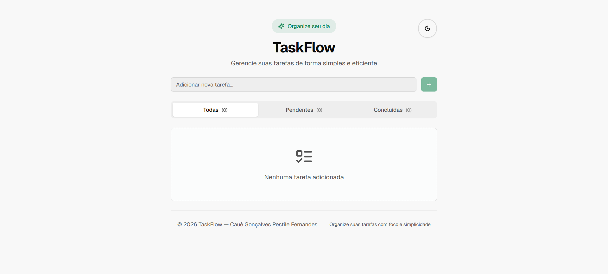

# 🚀 TaskFlow - Gerenciador de Tarefas (Next.js + TypeScript)

Bem-vindo(a) ao repositório do **TaskFlow**, uma aplicação web moderna desenvolvida com foco em organização, produtividade e boas práticas de desenvolvimento front-end.

## 📌 Sobre o Projeto

O **TaskFlow** é uma aplicação de gerenciamento de tarefas construída com **Next.js (App Router)** e **React**, permitindo controle completo das atividades através de operações CRUD.

O projeto foi desenvolvido com foco em componentização reutilizável, organização de código, experiência do usuário e aplicação de boas práticas modernas de desenvolvimento.

## 🌐 Deploy do Projeto

👉 https://to-do-list-eight-gamma-69.vercel.app

Aplicação hospedada na **Vercel**, utilizando ambiente otimizado para aplicações Next.js.

## 📸 Preview do Projeto
### Dark Theme

### Light Theme

---

## ✨ Funcionalidades

- CRUD completo de tarefas (Criar, Listar, Atualizar e Deletar)
- Filtros dinâmicos:
  - Todas
  - Pendentes
  - Concluídas
- Controle de estado no client-side
- Tema claro/escuro com persistência
- Componentes reutilizáveis e organizados
- Interface moderna e responsiva
- Feedback visual para ações do usuário
- Estrutura baseada no App Router do Next.js

---

## 🛠️ Tecnologias Utilizadas

- HTML5  
- Tailwind CSS  
- React  
- TypeScript  
- Next.js (App Router)  
- Shadcn UI  
- Vercel (Deploy)

---

## 🧠 Destaques Técnicos

- Uso de **TypeScript** para tipagem forte e maior segurança no código  
- Organização modular seguindo boas práticas do **Next.js App Router**  
- Componentização pensada para escalabilidade  
- Gerenciamento de estado eficiente no client  
- Persistência de tema utilizando armazenamento local  
- Estrutura preparada para futura integração com API ou banco de dados  

---

## 💻 Como Executar Localmente

### 1. Clonar o repositório

```bash
git clone https://github.com/CaueGPF/NOME-DO-REPOSITORIO.git
````
### 2. Acessar a pasta do projeto
```bash
cd NOME-DO-REPOSITORIO
```
### 3. Instalar as dependências
```bash
npm install
```
### ou
```bash
yarn install
```
### 4. Rodar o projeto
```bash
npm run dev
```
### Abra no navegador
```bash
http://localhost:3000
```
## 🎯 Objetivo do Projeto

O TaskFlow foi desenvolvido como projeto prático para consolidar conhecimentos em:

- Next.js com App Router  
- React com TypeScript  
- Estruturação escalável de aplicações  
- Experiência do usuário (UX)  
- Performance e organização de código  

O foco foi simular um cenário real de aplicação moderna, aplicando conceitos utilizados no mercado.

---

## 👨‍💻 Autor

**Cauê Gonçalves Pestile Fernandes**  
[LinkedIn](https://www.linkedin.com/in/cauegpf/) | [GitHub](https://github.com/CaueGPF)

Este projeto foi desenvolvido com foco em qualidade de código, organização, escalabilidade e experiência do usuário.
